 
## 查看主页获取源码

> **作者介绍**： **✌**全网粉丝10W+本平台特邀作者、博客专家、CSDN新星计划导师、java领域优质创作者,博客之星、掘金/华为云/阿里云/InfoQ等平台优质作者、专注于项目实战 **✌**

  

### 一、作品包含

源码+数据库+全套环境和工具资源+部署教程

### 二、项目技术

前端技术：Html、Css、Js、Vue、Element-ui

数据库：MySQL

后端技术：Java、Spring Boot、MyBatis

  

### 三、运行环境

开发工具：IDEA

数据库：MySQL8.0

数据库管理工具：Navicat10以上版本

环境配置软件： JDK1.8+Maven3.6.3

前端Nodejs：16

### 四、项目介绍
项目编号：springbootA149

商城管理系统作为现代电子商务的核心组成部分，其背景是依托于日益成熟的互联网技术和不断增长的网络购物需求，通过高效的信息处理和数据分析，实现对商品、订单、客户、库存等关键商业环节的精细化管理，以提升用户体验，优化运营效率，促进销售增长，为商家在激烈的市场竞争中提供强有力的技术支持。

前台模块:用户登录、购物车、我的订单、个人中心、商品评价、修改密码等。

后台模块:管理员登录、订单管理、商品管理、营销管理、权限管理、个人中心等。

### 五、运行截图

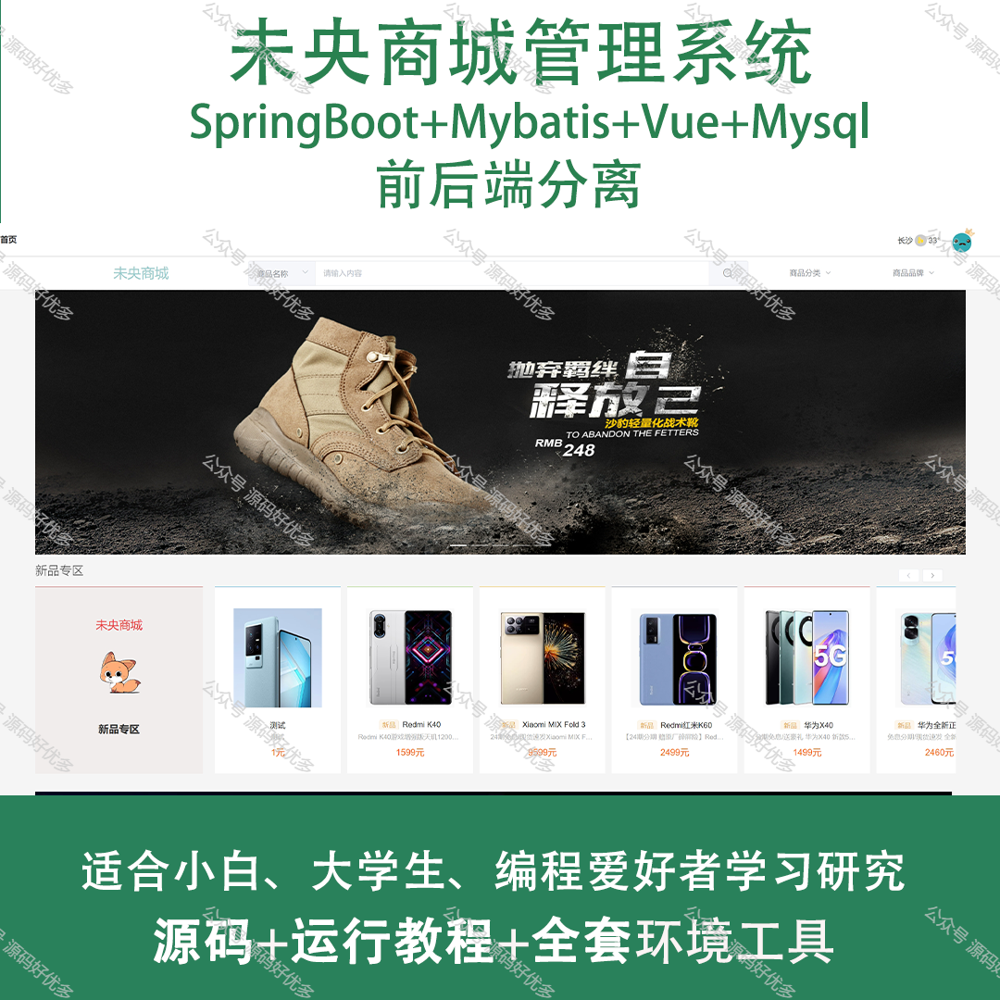
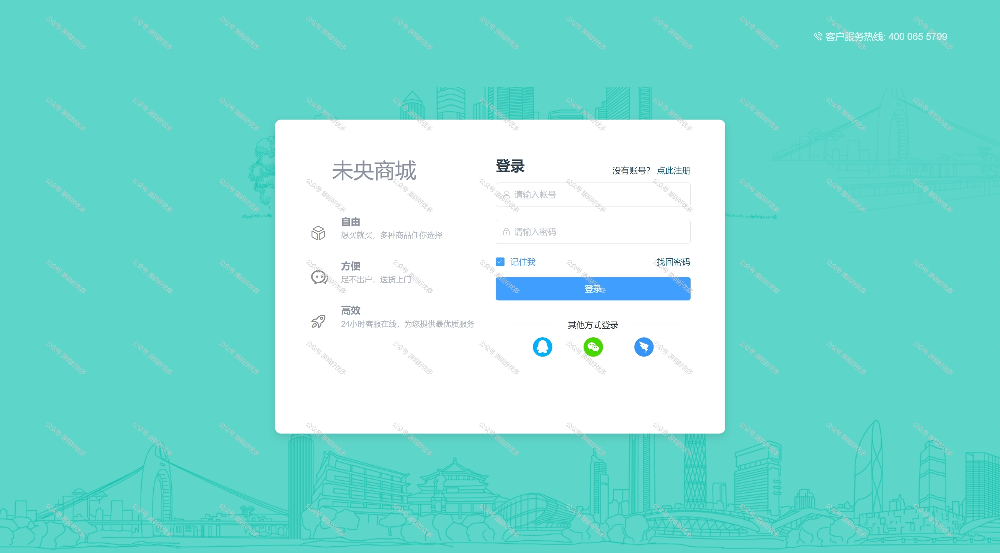
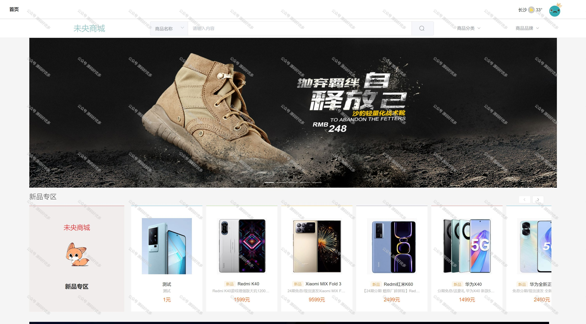
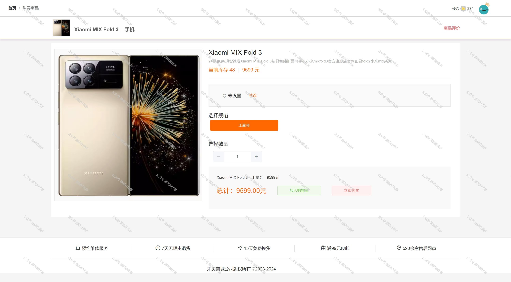
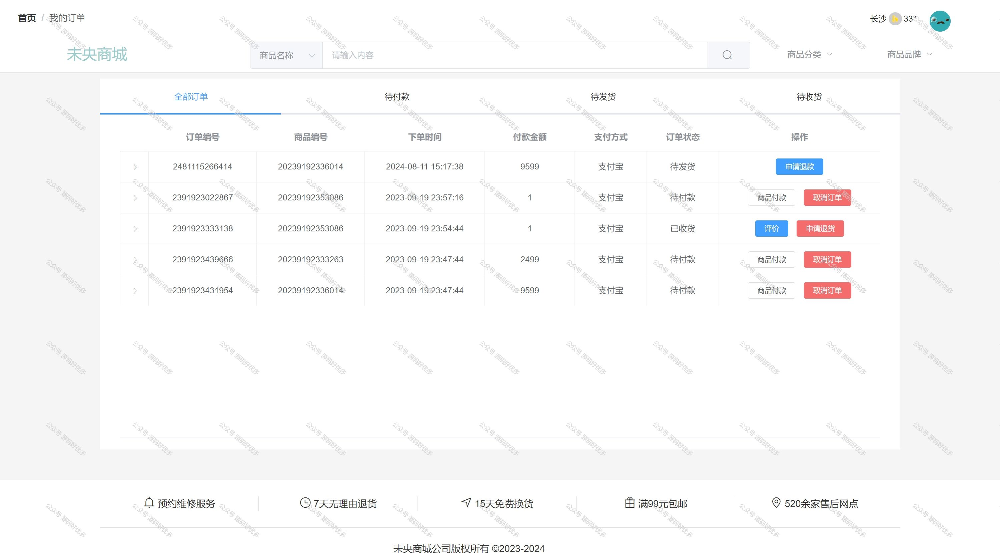
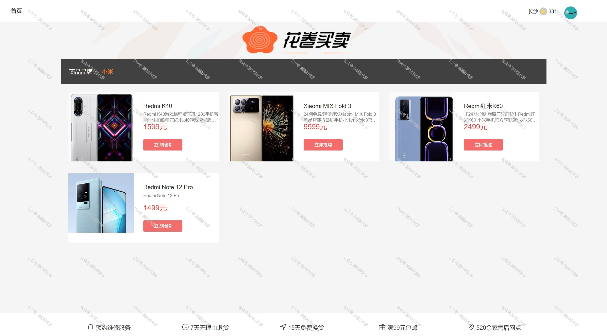
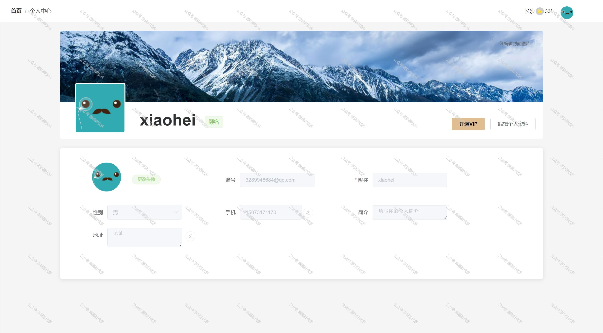
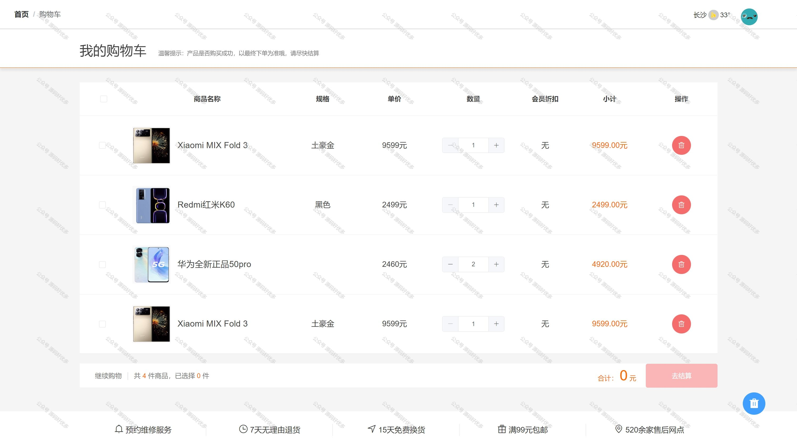
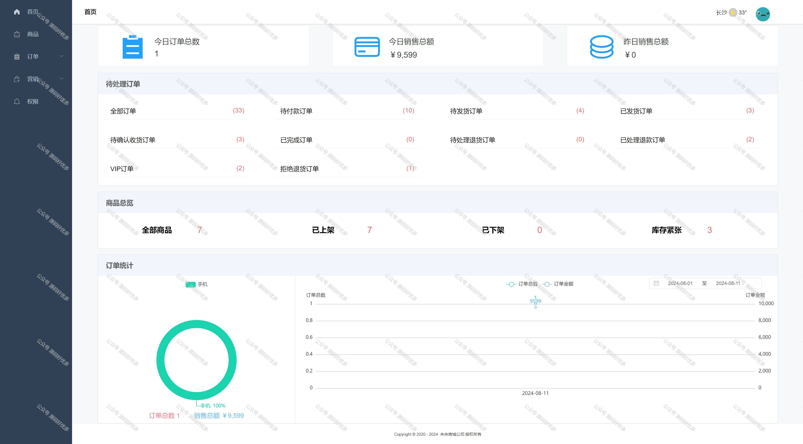
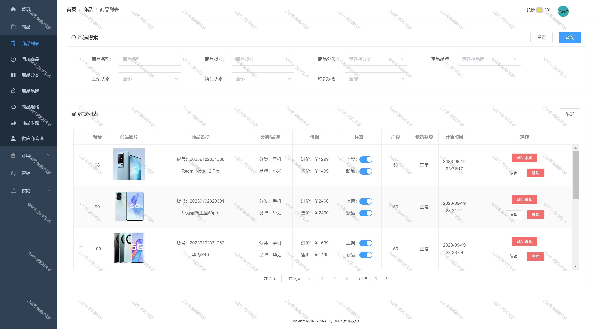
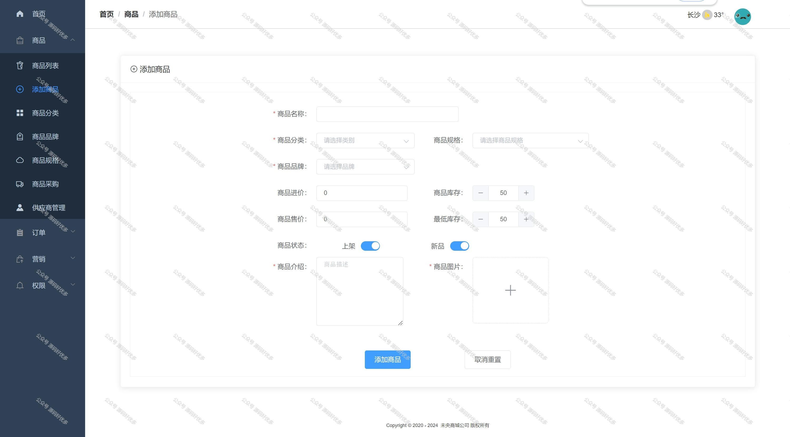

  
